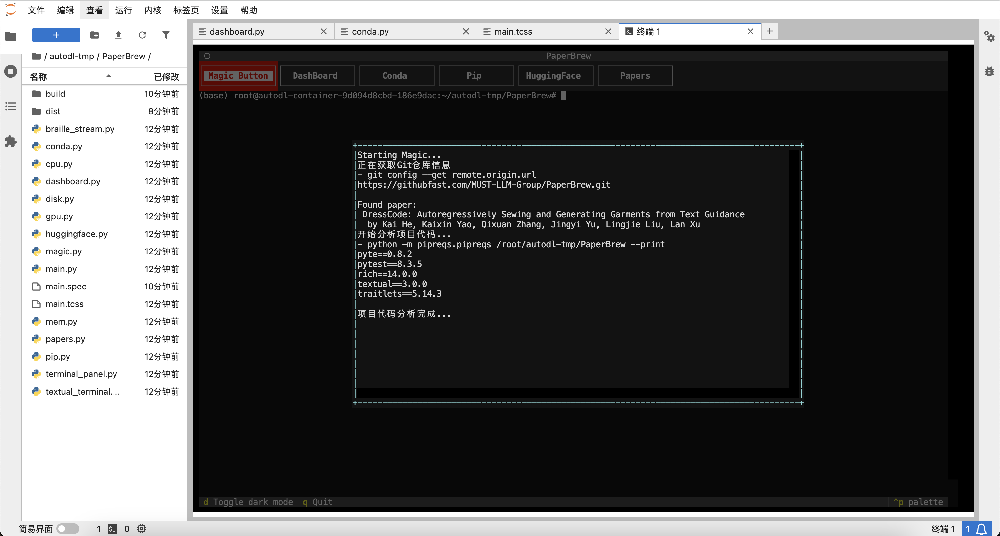

# PaperBrew 🍻

A TUI application to help manage Python virtual environments and packages while you are brewing your paper.


## Usage
Download the latest [binary release](https://github.com/MUST-LLM-Group/PaperBrew/releases/) and run it.

## Development
Python 3.7+ is required.
```
pip install textual textual-dev psutil pyte
```

```
pyinstaller main.py --add-data "main.tcss:."
```

## TODO List
- [x] Add a `conda` tab to manage conda environments.
- [x] Add a `pip` tab to install/uninstall packages.